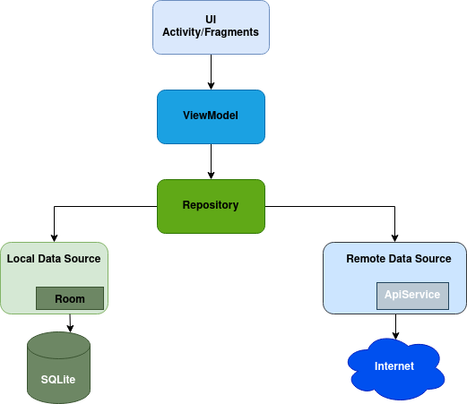

# Weather App

This is a simple app that implements the following features

- [x] List Cities - Comes with ~42K cities even without data connection(only 20 displayed).
- [x] Connect to Internet and fetch data for up to 7 days ahead, with 48 hours of hourly weather updates
- [x] Temperatures on the listed cities when you have connected to internet in the past 48 hours.
- [x] Details of city weather with listing up to 7 days ahead
- [x] Favouriting city from detail view, gets listed on the top
- [x] Notification of hourly weather update for every favourite city.
- [x] Ready for extension with inbuilt cities - only top 20 are displayed.

### Running
You will need a `key.properties` file with `API_KEY=abckey`, you can get the key from [openweathermap](https://openweathermap.org/)
Configuration for playstore key if need be

### Screenshots

  


## Architecture Components Used
- [x] Work Manager to deliver hourly notifications for favourite cities
- [x] ViewModel to provide data to UI and preserve data through configuration changes
- [x] Room to store cities and their forecast data and ensure availability even when offline.
- [x] Data binding to observe city info directly from the ViewModel
- [x] Navigation
- [x] LifeCycle to know when it's sunrise/sunset for hourly notifications

## App Architecture Overview



## Used Layers

### 1. Domain
The core layer that the app is built around. This is independent of other layers which allows the models and business logic to be independent of other layers.
Components of domain layer include:
- __Models__: Defines the core structure of the data that will be used within the application.

- __Repositories__: Interfaces that are implemented in data access implementations.

### 2. Data
This is responsible for selecting the proper data source for the domain layer. It contains the implementations of the repositories declared in the domain layer.

Components of data layer include:
- __Models__

  - __DTO Models__: Defines POJO(Data classes) of network responses - e.g. Forecast.

  - __Entity Models__: Defines the schema of Room(SQLite) database.

- __Repositories__: Responsible for exposing data to the domain layer.

- __Mappers__: They perform data transformation between ```domain```, ```dto``` and ```entity``` models.

- __Remote__: This is responsible for performing network operations e.g. defining API endpoints using [Retrofit](https://square.github.io/retrofit/).
    - __APIService__: Provides access to the API endpoints via network.
    - __Network Data Source__:  Provides data from the network, you can also have LocalDataSource for handling data from the local database.

- __Local__: This is responsible for performing caching operations using [Room](https://developer.android.com/training/data-storage/room).
    - __DAO Interfaces__: wrappers provided by Room for writing queries on the database. 

    
### 3. Presentation
The ```presentation``` layer contains components involved in showing information to the user. The main part of this layer are the views and viewModels.


## Tech-stack

* Gradle
    * [Gradle Kotlin DSL](https://docs.gradle.org/current/userguide/kotlin_dsl.html) - For reference purposes, here's an [article explaining the migration](https://medium.com/@evanschepsiror/migrating-to-kotlin-dsl-4ee0d6d5c977).
    * Plugins
        * [Ktlint](https://github.com/JLLeitschuh/ktlint-gradle) - creates convenient tasks in your Gradle project that run ktlint checks or do code auto format.
        * [Detekt](https://github.com/detekt/detekt) - a static code analysis tool for the Kotlin programming language.
        * [Spotless](https://github.com/diffplug/spotless) - format java, groovy, markdown and license headers using gradle.
        * [Dokka](https://github.com/Kotlin/dokka) - a documentation engine for Kotlin, performing the same function as javadoc for Java.
        * [jacoco](https://github.com/jacoco/jacoco) - a Code Coverage Library.
        * [Gradle Versions](https://github.com/ben-manes/gradle-versions-plugin) - provides a task to determine which dependencies have updates. Additionally, the plugin checks for updates to Gradle itself.
        
### Thanks to [SimpleMaps](https://simplemaps.com/) for the comprehensive city data.
